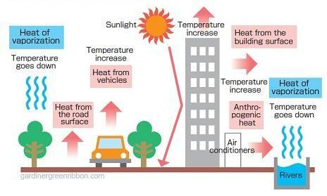
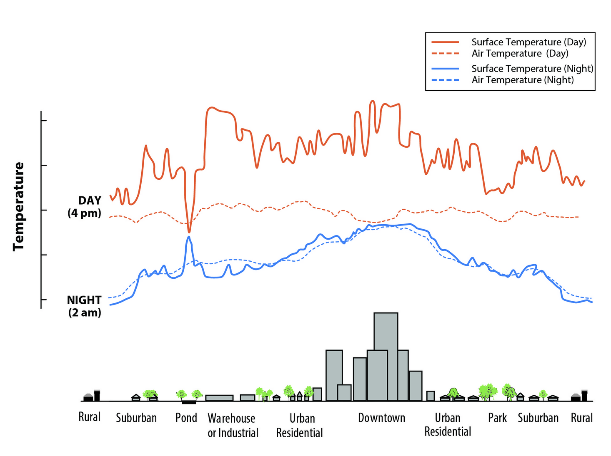
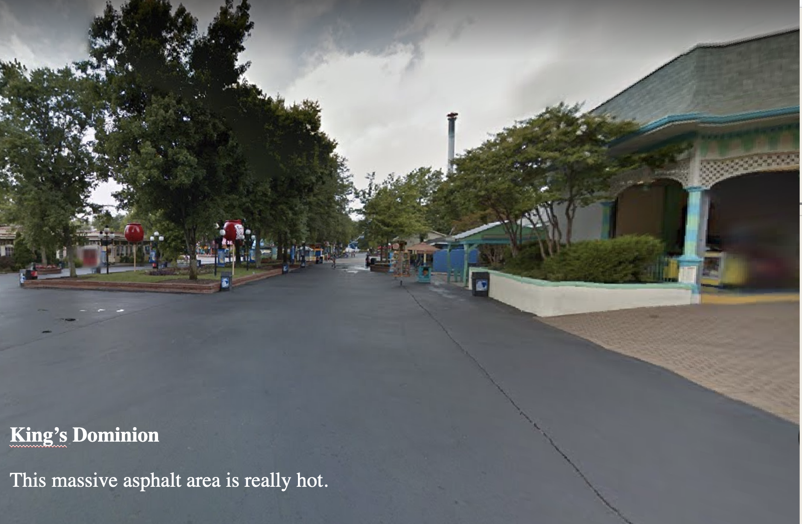
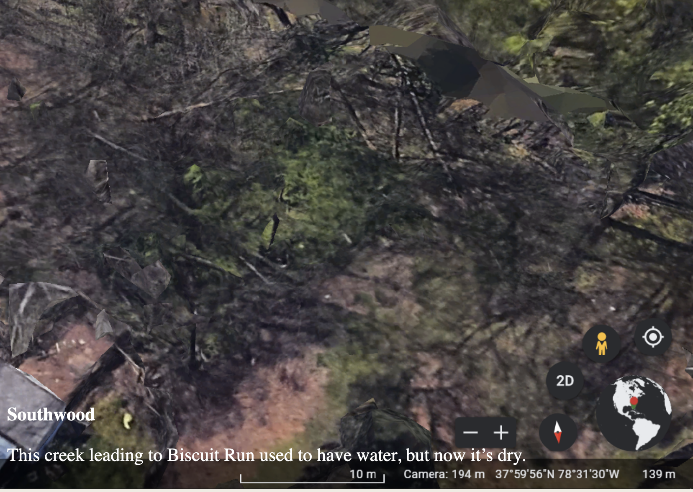
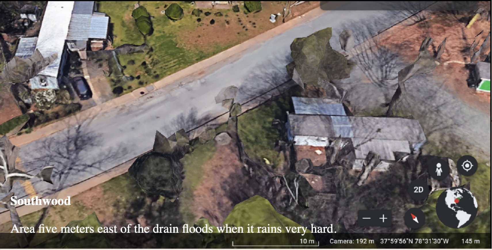
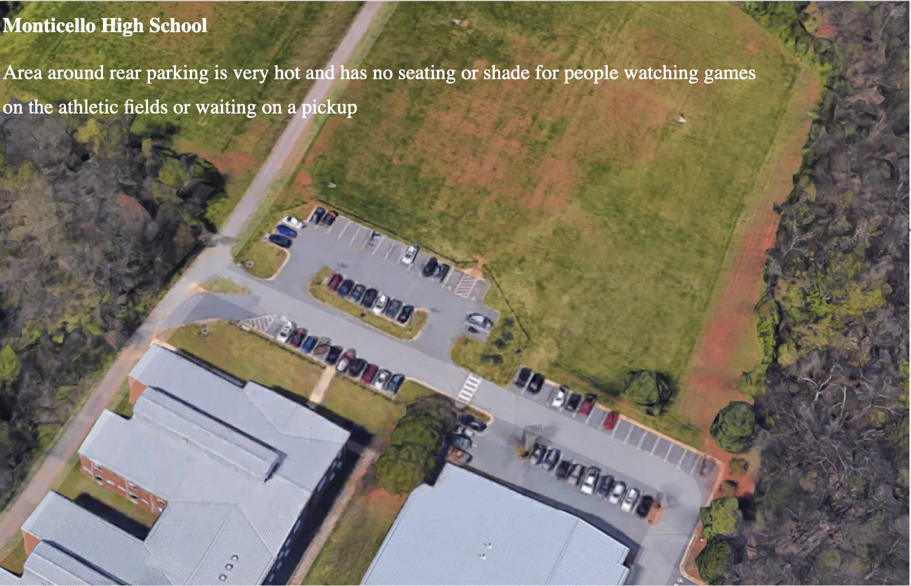
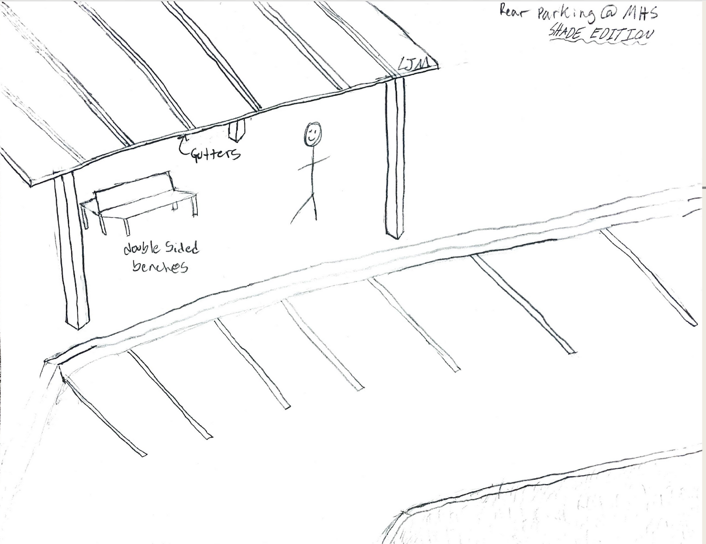
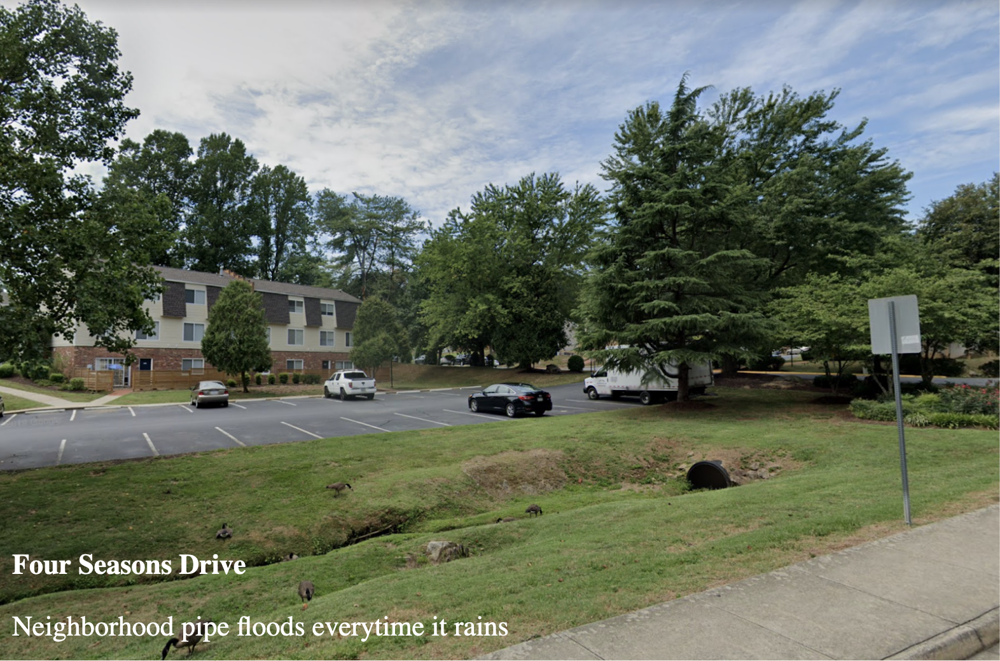

```{r setup, include=FALSE}
knitr::opts_chunk$set(echo = FALSE, warning = FALSE, message = FALSE)

library(knitr)
library(tidyverse)
library(sf)
library(leaflet)
library(plotly)
library(RColorBrewer)
library(ggthemes)
library(scales)
library(patchwork)

# locality names
localities <- data.frame(
  cntyfips = c("003", "540", "065", "079", "109", "125"),
  cntyname = c("Albemarle", "Charlottesville", "Fluvanna",
               "Greene", "Louisa", "Nelson"))

```

<br>

In Summer 2021, the UVA School of Architecture Project Pipeline Youth Design Mentorship Program participants learned about the heat island effect. The youth participants then produced digital art displaying the local impacts of the heat island effect and other climate-change related impacts in their community. 

At the same time, the Equity Center Democratization of Data Team was working to generate more accessible heat data that could be integrated with information about landscapes and people.

This project combines those two efforts into a single data story about local heat island effects.

## Heat and Heat Islands
Heat islands are areas with higher temperatures relative to outlying areas created by conditions like reduced vegetation, greater heat retention of impermeable surfaces like asphalt, paving, and cement, and heat generated by human activity.

```{r phxfig, out.width='90%', fig.align='center', fig.cap="Source: https://phxcubesat.asu.edu/science"}

```

Heat islands have a range of impacts, including

* Increased energy costs for air conditioning
* Increased air pollutants and greenhouse gasses because of increased electricity use for cooling 
* Increased harmful ground-level ozone from hot surfaces
* Reduced health and comfort
* Worse water quality and stress on warming aquatic systems

Source: [EPA Heat Island Impacts](https://www.epa.gov/heatislands/heat-island-impacts)

## Heat across the Region

Here we show the median land surface temperature within each census block group on July 4, 2020 as a deviation or difference from the median recorded temperature in the region. Hover over the map to see how much hotter or cooler a neighborhood was compared to the region as a whole.

### Land Surface Temperature

```{r landblkgp}
# lsat
ls8 <- read_csv("../data-csv/landsat8_cville_blkgps.csv")
ls8 <- ls8 %>% 
  mutate(GEOID = as.character(GEOID))

ls8_jul4 <- ls8 %>% 
  filter(start_date == as.Date("2020-07-04")) %>% 
  mutate(med_dev = median - mean(median))
# July 4 2020: min/max = 22/33, 71.6/91.4

# block group geo
blkgp <- readRDS("../data-csv/cville_blkgps.RDS")
blkgp <- st_transform(blkgp, crs = 4326)

ls8_jul4_geo <- left_join(blkgp, ls8_jul4, by = "GEOID") %>% 
  left_join(localities, by = c("COUNTYFP" = "cntyfips"))

ls8_jul4_geo <- ls8_jul4_geo %>% 
  mutate(dev_breaks = cut(med_dev, 
                          breaks = c(-50, -20, -15, -10, -5, -2.5, 2.5, 5, 10, 20, 50),
                          include.lowest = TRUE,
                          labels = c("-25 or less", "-20 to -15",
                                     "-15 to -10", "-10 to -5",
                                     "-5 to -2.5", "-2.5 to 2.5",
                                     "2.5 to 5", "5 to 10",
                                     "10 to 20", "20 or more")),
         break_colors = case_when(
           dev_breaks == "-25 or less" ~ "#5e4fa2",
           dev_breaks == "-20 to -15" ~ "#3288bd",
           dev_breaks == "-15 to -10" ~ "#66c2a5",
           dev_breaks == "-10 to -5" ~ "#abdda4",
           dev_breaks == "-5 to -2.5" ~ "#e6f598",
           dev_breaks == "-2.5 to 2.5" ~ "#ffffbf",
           dev_breaks == "2.5 to 5" ~ "#fee08b",
           dev_breaks == "5 to 10" ~ "#fdae61",
           dev_breaks == "10 to 20" ~ "#f46d43",
           dev_breaks == "20 or more" ~ "#d53e4f"
         ),
         break_colors = factor(break_colors, 
                               levels = c("#5e4fa2", "#3288bd", 
                                          "#66c2a5", "#abdda4",
                                          "#e6f598", "#ffffbf",
                                          "#fee08b", "#fdae61", 
                                          "#f46d43", "#d53e4f")))

leaflet(data = ls8_jul4_geo) %>% 
  addProviderTiles("CartoDB.Positron") %>%
  addPolygons(data = ls8_jul4_geo,
              fillColor = ~break_colors,
              label = ~paste(cntyname, 
                             round(med_dev,2), sep = ", "),
              weight = 1,
              opacity = 1,
              color = "white",
              fillOpacity = 0.7,
              highlight = highlightOptions(
                weight = 2,
                fillOpacity = 0.8,
                bringToFront = T),
#              popup = paste0("Degrees above Average: ", round(ls8_jul4_geo$med_dev,2))
              ) %>% 
  addLegend(position = "topright", 
            labels = levels(ls8_jul4_geo$dev_breaks),
            colors = levels(ls8_jul4_geo$break_colors), 
            title = "Compared to Average",
            group = "Hide/Show Legend") %>% 
  addLayersControl(overlayGroups = c("Hide/Show Legend"),
                   options = layersControlOptions(collapsed = FALSE),
                   position = "bottomright")

```

<details><summary>What is land surface temperature data?</summary><br/>

Heat islands are most frequently analyzed using satellite imagery data, like the LandSat 8 imagery we used above. With the satellite images, we can extract temperature estimates for each 30-meter square area. We intersected the 30-meter squares with census block and census block groups -- larger areas used by the census in estimating population characteristics -- and calculated the minimum, maximum, median, and average value across every 30-meter square within a census block or block group. 

Daytime land surface temperature measurements like these are typically higher than the air temperature felt by 

```{r heatepa, out.width='5 0%', fig.align='center', fig.cap="Source: EPA, Learn about Heat Islands (https://www.epa.gov/heatislands/learn-about-heat-islands)"}

```

</details>


## Heat in Charlottesville{.tabset}
Heat islands are typically a feature of more urban settings, and you can see the concentration of above average regional temperatures in central Charlottesville. Let's focus in on this area.

Here we show the same data, the median land surface temperature on July 4, 2020, this time as the difference between the temperature in a city block compared to average temperature in the city. The maximum air temperature recorded for Charlottesville on that day was 91 degrees Fahrenheit.

Hover over the map to see how much hotter or cooler a block was compared to the city as a whole.

```{r cityheat}
ls_cville <- read_csv("../data-csv/landsat8_cville_city.csv")

ls_cville_jul4 <- ls_cville %>% 
  mutate(GEOID = as.character(GEOID)) %>% 
  filter(spatial_unit == "blocks", 
         `Date Acquired` == as.Date("2020-07-04")) %>% 
  mutate(fips5 = str_sub(GEOID, 1,5),
         tract = str_sub(GEOID, 6,11),
         block = str_sub(GEOID, 12,15)) %>% 
  mutate(med_dev = median - mean(median, na.rm = TRUE))

# join to geography
cville_blocks <- readRDS("../data-csv/cville_blocks.RDS")
cville_blocks <- cville_blocks %>% 
  mutate(GEOID = as.character(GEOID10)) %>% 
  filter(COUNTYFP10 == "540")

cville_blocks <- st_transform(cville_blocks, 4326)

ls_cvl_jul4_geo <- cville_blocks %>% 
  left_join(ls_cville_jul4, by = "GEOID")

ls_cvl_jul4_geo <- ls_cvl_jul4_geo %>% 
  mutate(dev_breaks = cut(med_dev, 
                          breaks = c(-100, -20, -15, -10, -5, -2.5, 2.5, 5, 10, 20, 50),
                          include.lowest = TRUE,
                          labels = c("-25 or less", "-20 to -15",
                                     "-15 to -10", "-10 to -5",
                                     "-5 to -2.5", "-2.5 to 2.5",
                                     "2.5 to 5", "5 to 10",
                                     "10 to 20", "20 or more")),
         break_colors = case_when(
           dev_breaks == "-25 or less" ~ "#5e4fa2",
           dev_breaks == "-20 to -15" ~ "#3288bd",
           dev_breaks == "-15 to -10" ~ "#66c2a5",
           dev_breaks == "-10 to -5" ~ "#abdda4",
           dev_breaks == "-5 to -2.5" ~ "#e6f598",
           dev_breaks == "-2.5 to 2.5" ~ "#ffffbf",
           dev_breaks == "2.5 to 5" ~ "#fee08b",
           dev_breaks == "5 to 10" ~ "#fdae61",
           dev_breaks == "10 to 20" ~ "#f46d43",
           dev_breaks == "20 or more" ~ "#d53e4f"
         ),
         break_colors = factor(break_colors, 
                               levels = c("#5e4fa2", "#3288bd", 
                                          "#66c2a5", "#abdda4",
                                          "#e6f598", "#ffffbf",
                                          "#fee08b", "#fdae61", 
                                          "#f46d43", "#d53e4f")))

leaflet(data = ls_cvl_jul4_geo) %>% 
  addProviderTiles("CartoDB.Positron") %>%
  addPolygons(data = ls_cvl_jul4_geo,
              fillColor = ~break_colors,
              label = ~round(med_dev,2),
              weight = 1,
              opacity = 1,
              color = "white",
              fillOpacity = 0.7,
              highlight = highlightOptions(
                weight = 2,
                fillOpacity = 0.8,
                bringToFront = T),
              #              popup = paste0("Degrees above Average: ", round(ls8_jul4_geo$med_dev,2))
  ) %>% 
  addLegend(position = "topright", 
            labels = levels(ls_cvl_jul4_geo$dev_breaks),
            colors = levels(ls_cvl_jul4_geo$break_colors), 
            title = "Compared to Median",
            group = "Hide/Show Legend") %>% 
  addLayersControl(overlayGroups = c("Hide/Show Legend"),
                   options = layersControlOptions(collapsed = FALSE),
                   position = "bottomright")

```

Below you can compare the areas of greater heat to the areas with a higher percent tree canopy or a higher percent of surfaces covered with impervious materials.

There is a very clear relationship -- blocks with  more tree canopy and less impervious surface have notably lower land surface temperatures.

### Tree Canopy

```{r tree}
## nlcd city blocks ----
ncld_cvl <- read_csv("../data-csv/nlcd_cville_blocks.csv")
ncld_cvl <- ncld_cvl %>% 
  mutate(GEOID = as.character(GEOID10)) %>% 
  filter(COUNTYFP == "540")

# join
nlcd_cvl_geo <- cville_blocks %>% 
  left_join(ncld_cvl, by = "GEOID")

pal <- colorBin(palette = "Greens",
                domain = nlcd_cvl_geo$tree_can,
                bins = 9)

leaflet(data = nlcd_cvl_geo) %>% 
  addProviderTiles("CartoDB.Positron") %>%
  addPolygons(data = nlcd_cvl_geo,
              fillColor = ~pal(tree_can),
              label = ~round(tree_can,2),
              weight = 1,
              opacity = 1,
              color = "white",
              fillOpacity = 0.7,
              highlight = highlightOptions(
                weight = 2,
                fillOpacity = 0.8,
                bringToFront = T),
  ) %>% 
  addLegend(position = "topright", 
            pal = pal, values = nlcd_cvl_geo$tree_can, 
            title = "Percent Canopy",
            group = "Hide/Show Legend") %>% 
  addLayersControl(overlayGroups = c("Hide/Show Legend"),
                   options = layersControlOptions(collapsed = FALSE),
                   position = "bottomright")
```

<details><summary>What is this data?</summary><br/>

The percent of an area covered with tree canopy is derived from the [National Land Cover Database](https://www.mrlc.gov/).

</details>

### Impervious Surfaces

```{r impsurf}
pal <- colorBin(palette = "Reds",
                domain = nlcd_cvl_geo$imp_surf,
                bins = 9)

leaflet(data = nlcd_cvl_geo) %>% 
  addProviderTiles("CartoDB.Positron") %>%
  addPolygons(data = nlcd_cvl_geo,
              fillColor = ~pal(imp_surf),
              label = ~round(imp_surf,2),
              weight = 1,
              opacity = 1,
              color = "white",
              fillOpacity = 0.7,
              highlight = highlightOptions(
                weight = 2,
                fillOpacity = 0.8,
                bringToFront = T),
              #              popup = paste0("Degrees above Average: ", round(ls8_jul4_geo$med_dev,2))
  ) %>% 
  addLegend(position = "topright", 
            pal = pal, values = nlcd_cvl_geo$tree_can, 
            title = "Percent Impervious",
            group = "Hide/Show Legend") %>% 
  addLayersControl(overlayGroups = c("Hide/Show Legend"),
                   options = layersControlOptions(collapsed = FALSE),
                   position = "bottomright")
```

<details><summary>What is this data?</summary><br/>

The percent of an area covered with impervious surfaces is derived from the [National Land Cover Database](https://www.mrlc.gov/).

</details>


### Association with Land Surface Temp

```{r blockcorr}
## join block data ----
cvl_ls8_nlcd <- cville_blocks %>% 
  left_join(ls_cville_jul4, by = "GEOID") %>% 
  left_join(ncld_cvl, by = "GEOID")

# scatterplots
p1 <- ggplot(cvl_ls8_nlcd, aes(x = tree_can, y = med_dev, color = tree_can)) +
  geom_point() +
  labs(x = "% Tree Canopy", y = "Land Surface Temp (Temp - City Median)") +
  scale_color_gradient(name = "", low = "#ffffe5", high = "#00441b") +
  theme(legend.position = "bottom")

p2 <- ggplot(cvl_ls8_nlcd, aes(x = imp_surf, y = med_dev, color = imp_surf)) +
  geom_point() +
    labs(x = "% Impervious Surface", y = "Land Surface Temp (Temp - City Median)") +
  scale_color_gradient(name = "", low = "#ffffcc", high = "#a50f15") +
  theme(legend.position = "bottom")

p1 + p2
```

The figures above plot the value of the tree canopy or the impervious surface estimates of each census block along the x-axis along the bottom and median temperature deviation from the overall land surface temperature of each census block along the y-axis on the side.


## Land Surface Temperature and Populations
With land surface temperature aggregated to the block group, we can begin to visualize how temperature varies across the region as a function of the type of people who live there.

```{r incage}
## cville blockgroups only
ls8_jul4_geo_cvl <-
  ls8_jul4_geo %>% 
  filter(COUNTYFP %in% c("540")) %>% 
  mutate(med_dev = median - mean(median)) 

ls8_jul4_geo_cvl <- ls8_jul4_geo_cvl %>% 
  mutate(dev_breaks = cut(med_dev, 
                          breaks = c(-30, -25, -20, -15, -10, -5, -2.5, 2.5, 5, 10, 15, 20),
                          include.lowest = TRUE,
                          labels = c("-25 or less", "-25 to -20",
                                     "-20 to -15", "-15 to -10",
                                     "-10 to -5", "-5 to -2.5", 
                                     "-2.5 to 2.5", "2.5 to 5", 
                                     "5 to 10", "10 to 15",
                                     "15 or more")),
         break_colors = case_when(
           dev_breaks == "-25 or less" ~ "#5e4fa2",
           dev_breaks == "-25 to -20" ~ "#3288bd",
           dev_breaks == "-20 to -15" ~ "#66c2a5",
           dev_breaks == "-15 to -10" ~ "#abdda4",
           dev_breaks == "-10 to -5" ~ "#e6f598",
           dev_breaks == "-5 to -2.5" ~ "#ffffbf",
           dev_breaks == "-2.5 to 2.5" ~ "#fee08b",
           dev_breaks == "2.5 to 5" ~ "#fdae61",
           dev_breaks == "5 to 10" ~ "#f46d43",
           dev_breaks == "10 to 15" ~ "#d53e4f",
           dev_breaks == "15 or more" ~ "#9e0142"
         ),
         break_colors = factor(break_colors, 
                               levels = c("#5e4fa2", "#3288bd", 
                                          "#66c2a5", "#abdda4",
                                          "#e6f598", "#ffffbf",
                                          "#fee08b", "#fdae61", 
                                          "#f46d43", "#d53e4f",
                                          "#9e0142"))
         )

## income, race
acs <- read_csv("../data-csv/acs_cville_blkgp.csv")
acs <- acs %>% mutate(GEOID = as.character(GEOID))

# join to jul 4
ls8_jul4_acs <- ls8_jul4_geo_cvl %>% 
  left_join(acs, by = "GEOID")

p1 <- ls8_jul4_acs %>% 
  ggplot(aes(x = hhincE, y = med_dev, color = med_dev)) + 
  geom_point() +
  labs(x = "Median HH Income", y = "Land Surface Temp (Temp - Region Median)") +
  scale_color_distiller(name = "", palette = "Spectral") +
  scale_x_continuous(labels = label_dollar(), breaks = c(25000, 50000, 75000, 100000, 125000)) +
  theme_minimal() +
  theme(legend.position = "bottom")

p2 <- ls8_jul4_acs %>% 
  ggplot(aes(x = homeownE, y = med_dev, color = med_dev)) + 
  geom_point() +
  labs(x = "% Owning Home", y = "") +
  scale_color_distiller(name = "", palette = "Spectral") +
  scale_x_continuous(labels = label_percent(scale = 1)) +
  theme_minimal() +
  theme(legend.position = "bottom")

p3 <- ls8_jul4_acs %>% 
  ggplot(aes(x = whiteE, y = med_dev, color = med_dev)) + 
  geom_point() +
  labs(x = "% White", y = "") +
  scale_color_distiller(name = "", palette = "Spectral") +
  scale_x_continuous(labels = label_percent(scale = 1)) +
  theme_minimal() +
  theme(legend.position = "bottom")

p4 <- ls8_jul4_acs %>% 
  ggplot(aes(x = blackE, y = med_dev, color = med_dev)) + 
  geom_point() +
  labs(x = "% Black", y = "") +
  scale_color_distiller(name = "", palette = "Spectral") +
  scale_x_continuous(labels = label_percent(scale = 1)) +
  theme_minimal() +
  theme(legend.position = "bottom")

paxis <- ggplot(data.frame(l = p1$labels$y, x = 1, y = 1)) +
  geom_text(aes(x, y, label = l), angle = 90) + 
  theme_void() +
  coord_cartesian(clip = "off")

p1$labels$y <- ""

paxis + wrap_plots(p1, p2, p3, p4) + plot_layout(guides='collect', widths = c(1,25)) &
  theme(legend.position='bottom')
```

* Within Charlottesville, higher income households tend to be in neighborhoods with lower land surface temperatures. The median household income among households in the coolest block groups are all above $75,000.
* The relationship is even stronger between temperature and the percent of neighborhood residents who own their homes -- neighborhoods with the highest rate of home ownership experience the coolest temperatures.
* The differences by the race of residents in a neighborhood are less stark, though the three areas with the lowest temperature are made up of predominantly white residents.

## Youth Art
After learning about the heat island effect, youth participants of the UVA School of Architecture Project Pipeline Youth Design Mentorship Program were given the following prompt:

‘Explore Google Earth (or Maps) and choose a place you go to frequently, like your home or school, where there’s flooding, drought, or really hot areas. Take a screenshot and suggest changes for the area.’ 

Click the images below to see the images the youth produced. 

<link rel="stylesheet" href="https://www.w3schools.com/w3css/4/w3.css">

<div class="w3-content w3-display-container">
  
  
  
  
  
  

<button class="w3-button w3-black w3-display-left" onclick="plusDivs(-1)">&#10094;</button>
<button class="w3-button w3-black w3-display-right" onclick="plusDivs(1)">&#10095;</button>
</div>

```{js}
var slideIndex = 1;
showDivs(slideIndex);

function plusDivs(n) {
  showDivs(slideIndex += n);
}

function showDivs(n) {
  var i;
  var x = document.getElementsByClassName("mySlides");
  if (n > x.length) {slideIndex = 1}
  if (n < 1) {slideIndex = x.length}
  for (i = 0; i < x.length; i++) {
    x[i].style.display = "none";  
  }
  x[slideIndex-1].style.display = "block";  
}
```

```{r}
# slide show options?
# used: https://www.w3schools.com/w3css/w3css_slideshow.asp
# https://www.w3docs.com/snippets/css/how-to-create-an-image-slider-or-slideshow.html
# http://css3.bradshawenterprises.com/sliding/
```

<br>

For more on urban heat islands, see the city of Charlottesville's Urban Heat Island Mapping Campaign: https<nolink>://www.charlottesville.gov/1469/Urban-Heat-Island-Mapping-Campaign

<br>

## Back to Story Site